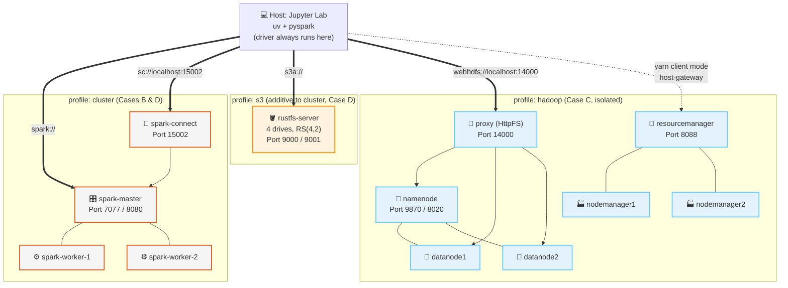

# ⚡ cdn-spark-lab: Apache Spark, From Laptop to Cluster

### **The Practical Guide to Distributed Data Processing**
Watch the *same* Bronze→Silver→Gold pipeline run on 4 growing infrastructures — local process, Spark Standalone cluster, YARN+HDFS, and S3-compatible object storage — with Spark as the one constant engine. Central thesis: **Spark doesn't replace storage, it replaces MapReduce.**


---

## 🎯 What is this repository?

A **hands-on lab** built around a single question: what actually changes when you move a Spark job from your laptop to a real cluster? Instead of 4 disconnected demos, this lab runs the **same pipeline and the same Gold aggregation** across 4 progressively more realistic architectures, so the differences you see are real, not incidental.

- 📖 **8 theory modules** — MapReduce's limits, RDDs/lineage, the DAG and lazy evaluation, DataFrames/Catalyst/Tungsten, PySpark internals, caching/AQE, Spark+HDFS, Spark+Object Storage.
- 💻 **14 interactive labs (00–13)** — starting with 4 business-flavored PySpark labs (`local[*]`, no Docker), then a YARN chaos lab and a 4-way benchmark dashboard.
- 🏗️ **One `docker-compose.yml`, three profiles** — `cluster` (Standalone + Spark Connect), `s3` (RustFS, additive to `cluster`), `hadoop` (HDFS + YARN, isolated). No duplicated Spark service definitions.
- 🧬 **Synthetic, reproducible business dataset** — `empresas`/`funcionarios`/`vendas` (companies, employees, sales), Faker + NumPy, fixed seed, generated on demand at `small` or `large` scale — zero internet dependency.
- 🏁 **A capstone benchmark** — the same Gold aggregation (sales by sector/month, broadcast join) measured across all 4 architectures side by side.

> **Target audience:** Data engineers, students, and anyone who has run `pip install pyspark` and now wants to understand what changes when Spark stops being alone on the machine.

---

## 🧭 The 4 Cases

| Case | Where the notebook runs | Cluster manager | Storage |
|---|---|---|---|
| **A — Local** | Host (`uv`) | `local[*]` (bundled with `pyspark`) | Local disk |
| **B — Cluster** | Host (`uv`), **Spark Connect** client | Spark Standalone (Docker) | Shared Docker volume |
| **C — Hadoop** | Host (`uv`), client mode + `host-gateway` | **YARN** (Docker) | HDFS (Docker), via HttpFS gateway |
| **D — Object Storage** | Host (`uv`), **Spark Connect** client | Spark Standalone (reused from B) | RustFS via `s3a://` (Docker) |

Every case uses the same client flow — `make setup-env` → `make jupyter-lab`, notebook always on the host — so the infrastructure is what changes, not your workflow.

---

## ⚡ Quick Start

```bash
# 1. Clone the repository
git clone https://github.com/hiltonmbr/cdn-spark-lab.git
cd cdn-spark-lab

# 2. Generate the synthetic dataset (Case A uses `small` by default)
make setup-env
make generate-data SCALE=small

# 3. Launch Jupyter Lab and start with Lab 00
make jupyter-lab
```

Case A (Labs 00–04) needs nothing beyond this — no Docker required. Later cases spin up their own infrastructure on demand:

```bash
make up-cluster   # Case B — Spark Standalone (master + 2 workers) + Spark Connect
make up-s3        # Case D — the cluster above + RustFS (4 drives, Erasure Coding)
make up-hadoop    # Case C — HDFS + YARN (2 DataNodes, 2 NodeManagers)
make down         # Stop everything, any profile
```

Run `notebooks/00_setup_check.ipynb` first to confirm Python, PySpark, and Docker are ready before each tier.

---

## ⚙️ Prerequisites

| Requirement | Details |
|---|---|
| **Docker Engine** | Required for Cases B, C, D (Case A runs with no Docker at all) |
| **Docker Compose** | Bundled in Docker Desktop |
| **uv** | Fast Python package manager ([Installation](https://docs.astral.sh/uv/getting-started/installation/)) |
| **Make** | Used for every shortcut below (optional — see the [Makefile](Makefile) for the raw commands) |
| **Resources** | ~4 GB RAM for `cluster`/`s3` profiles; **8 GB recommended** for the `hadoop` profile (~6 services) |
| **Disk** | A few GB free for the `large` dataset scale and HDFS replication |

```bash
docker version && docker compose version && uv --version
```

> **Case C and `host-gateway`:** Spark-on-YARN needs the driver (which always runs on your host in this lab) to be reachable by dynamically allocated executors. This lab uses Docker's native `host-gateway` (Docker 20.10+, all platforms) instead of running the notebook inside a container — see [`docs/07-spark-and-hdfs.md`](docs/07-spark-and-hdfs.md) for the full mechanism.

---

## 🗺️ Learning Map

### 📖 Theory

Read these in `docs/` before the matching lab tier — each consolidates the relevant sections of the Spark module into a direct, example-driven doc.

| # | Module | Precedes |
|:---:|---|:---:|
| 1 | [From MapReduce to Spark](docs/01-from-mapreduce-to-spark.md) — motivation, Driver/Executors/Cluster Manager | Tier A |
| 2 | [RDDs, Lineage & Partitioning](docs/02-rdds-lineage-partitions.md) | Tier A |
| 3 | [Transformations, Actions & the DAG](docs/03-transformations-actions-dag.md) — lazy evaluation, shuffle | Tier B |
| 4 | [DataFrames, Spark SQL, Catalyst & Tungsten](docs/04-dataframes-catalyst-tungsten.md) | Tier B |
| 5 | [PySpark in Practice](docs/05-pyspark-in-practice.md) — SparkSession, Py4J, Pandas UDFs, Spark Connect | Tier B |
| 6 | [Persistence & Optimization](docs/06-persistence-and-optimization.md) — cache, broadcast, AQE | Tier B |
| 7 | [Spark + HDFS](docs/07-spark-and-hdfs.md) — YARN, file formats, why `webhdfs://` | Tier C |
| 8 | [Spark + Object Storage](docs/08-spark-and-object-storage.md) — `s3a`, RustFS, trade-offs | Tier D |

### 🧪 Hands-on Labs

Open via `make jupyter-lab`. **Start with Lab 00** to validate your environment for whichever tier you're about to run.

| # | Tier | Notebook | Focus |
|:---:|:---:|---|---|
| 00 | — | [Setup Check](notebooks/00_setup_check.ipynb) | Validates Python, pyspark, Docker per tier |
| 01 | A · Local | [Primeiros Passos com PySpark](notebooks/01_primeiros_passos_pyspark.ipynb) | `select`, `filter`, `withColumn`, `show`/`collect`/`toPandas` on a business dataset |
| 02 | A · Local | [Agregações de Negócio](notebooks/02_agregacoes_de_negocio.ipynb) | `groupBy`/`agg`/`orderBy` — revenue by period, top sales, average ticket |
| 03 | A · Local | [Joins: Vendas + Funcionários + Empresas](notebooks/03_joins_vendas_funcionarios_empresas.ipynb) | Employee sales ranking, revenue by sector/period via chained joins |
| 04 | A · Local | [Por Trás dos Panos](notebooks/04_por_tras_dos_panos.ipynb) | RDD lineage, DAG, Catalyst plan, Spark SQL, cache, PySpark vs Pandas benchmark |
| 05 | B · Cluster | [Spark Connect](notebooks/05_spark_connect.ipynb) | Brings up the Standalone cluster, thin client, tour of the Spark UI |
| 06 | B · Cluster | [Shuffle, Wide vs Narrow, Broadcast Join](notebooks/06_shuffle_broadcast_join.ipynb) | `empresas` broadcast vs `funcionarios` shuffle join |
| 07 | B · Cluster | [Cache & Storage Levels](notebooks/07_cache_storage_levels.ipynb) | persist/unpersist, storage levels, AQE on/off |
| 08 | C · Hadoop | [HDFS + YARN Bootstrap](notebooks/08_hdfs_yarn_bootstrap.ipynb) | Read/write via the HttpFS gateway, compare against Case B |
| 09 | C · Hadoop | [spark-submit & Deploy Modes](notebooks/09_spark_submit_deploy_modes.ipynb) | client vs cluster mode, ResourceManager UI, Application Master |
| 10 | C · Hadoop | 🔥 [Chaos Lab](notebooks/10_chaos_lab.ipynb) | Kills a NodeManager mid-job, watches recomputation via lineage |
| 11 | D · S3 | [Spark + RustFS via `s3a://`](notebooks/11_spark_s3_rustfs.ipynb) | Path-style config, partitioned Parquet |
| 12 | D · S3 | [S3 vs HDFS Trade-offs](notebooks/12_s3_vs_hdfs_tradeoffs.ipynb) | Rename/commit cost, no locality, partition pruning |
| 13 | Capstone | 🏁 [Grand Benchmark](notebooks/13_grand_benchmark.ipynb) | Same Gold job across all 4 architectures + comparison dashboard |

---

## 🏗️ Project Structure

```
cdn-spark-lab/
├── docs/                      # 8 theory modules
├── notebooks/                 # 14 labs (00-13)
├── scripts/
│   ├── lab_utils.py           # SparkSession factory per tier + bronze/silver/gold helpers + benchmark helpers
│   ├── generate_dataset.py    # Synthetic dataset generator (Faker + NumPy, fixed seed)
│   └── start-hdfs.sh / init-datanode.sh  # Hadoop bootstrap scripts
├── config/
│   ├── hadoop/                # HDFS/YARN XML config (profile "hadoop", rendered from .env)
│   └── hadoop-client/         # Host-side driver config for YARN client mode
├── tests/
│   └── test_lab_utils.py      # Unit tests (no Docker required) — nbmake end-to-end tests run via `make test`
├── docker-compose.yml         # profiles: cluster, s3, hadoop
├── Makefile
├── pyproject.toml             # pyspark[connect], boto3, pandas, pyarrow, faker
└── data/ (git-ignored)        # bronze/silver/gold, generated locally
```

---

## 🏛️ Lab Architecture



---

## 📝 Makefile Reference

```bash
# ── Dataset ────────────────────────────────────────────────────────
make generate-data SCALE=small|large  # Generate empresas/funcionarios/vendas

# ── Infrastructure ────────────────────────────────────────────────
make up-cluster      # Case B — Spark Standalone + Spark Connect
make up-s3           # Case D — cluster + RustFS
make up-hadoop       # Case C — HDFS + YARN
make down            # Stop everything (any profile)
make clean           # Destroy containers, volumes, AND local/HDFS data
make clean-data      # Wipe only generated datasets in data/ and temp/
make status          # Show running containers
make logs            # Tail logs from all running containers
make shell-<name>    # Shell into any container (spark-master, namenode, ...)

# ── Python Environment ────────────────────────────────────────────
make setup-env       # Create .venv with uv, register Jupyter kernel, configure nbstripout
make jupyter-lab     # Launch Jupyter Lab (same command for all 4 cases)

# ── Quality ────────────────────────────────────────────────────────
make strip           # Strip all notebook outputs (run before committing)
make check           # Verify notebooks are output-stripped (CI gate)
make lint            # Run ruff on scripts/ and notebooks/
make test            # Run pytest + nbmake end-to-end notebook tests (relevant profile must be running)
```

---

## 🧪 Running Tests

```bash
# Unit tests (no Docker required)
uv run pytest tests/test_lab_utils.py -v

# Full end-to-end notebook tests (bring up the relevant profile first)
make up-cluster
make test
```

`make check` (notebook-strip verification) and `make lint` are meant to run in CI; end-to-end `nbmake` tests are intentionally local-only since they need multi-service Docker heavier than a standard CI runner.

---

## 📄 License and References

This project is made available under the [MIT License](LICENSE).

> **Open educational material.** Created for the hands-on classes of the **Data Science for Business** course (UFPB). Developed by Hilton Martins. Third lab in the Big Data series, after [`cdn-hadoop-lab`](https://github.com/hiltonmbr/cdn-hadoop-lab) and [`cdn-s3-lab`](https://github.com/hiltonmbr/cdn-s3-lab).

### References

- [Apache Spark Documentation](https://spark.apache.org/docs/latest/)
- [Spark Connect Overview](https://spark.apache.org/docs/latest/spark-connect-overview.html)
- [Apache Hadoop YARN](https://hadoop.apache.org/docs/stable/hadoop-yarn/hadoop-yarn-site/YARN.html)
- [WebHDFS REST API](https://hadoop.apache.org/docs/stable/hadoop-project-dist/hadoop-hdfs/WebHDFS.html)
- [Hadoop-AWS Module (`s3a://`)](https://hadoop.apache.org/docs/stable/hadoop-aws/tools/hadoop-aws/index.html)
- [RustFS Official Documentation](https://docs.rustfs.com)
