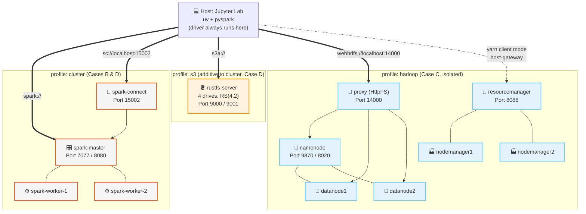

# ⚡ cdn-spark-lab: Apache Spark, Do Laptop ao Cluster

### **O Guia Prático de Processamento Distribuído de Dados**
Veja o *mesmo* pipeline Bronze→Silver→Gold rodar em 4 infraestruturas crescentes — processo local, cluster Spark Standalone, YARN+HDFS e armazenamento de objetos compatível com S3 — com o Spark como o motor constante. Tese central: **Spark não substitui armazenamento, ele substitui o MapReduce.**


---

## 🎯 O que é este repositório?

Um **laboratório prático** construído em torno de uma única pergunta: o que realmente muda quando você migra um job Spark do seu laptop para um cluster real? Em vez de 4 demonstrações desconectadas, este laboratório executa o **mesmo pipeline e a mesma agregação Gold** em 4 arquiteturas progressivamente mais realistas, para que as diferenças que você vê sejam reais, não acidentais.

- 📖 **8 módulos teóricos** — limites do MapReduce, RDDs/linhagem, DAG e avaliação lazy, DataFrames/Catalyst/Tungsten, internals do PySpark, caching/AQE, Spark+HDFS, Spark+Armazenamento de Objetos.
- 💻 **14 laboratórios interativos (00–13)** — começando com 4 labs PySpark com sabor de negócios (`local[*]`, sem Docker), depois um lab de caos YARN e um dashboard de benchmark 4-vias.
- 🏗️ **Um `docker-compose.yml`, três perfis** — `cluster` (Standalone + Spark Connect), `s3` (RustFS, aditivo ao `cluster`), `hadoop` (HDFS + YARN, isolado). Sem definições duplicadas de serviço Spark.
- 🧬 **Dataset sintético de negócios, reproduzível** — `empresas`/`funcionarios`/`vendas`, Faker + NumPy, semente fixa, gerado sob demanda nas escalas `small` ou `large` — zero dependência de internet.
- 🏁 **Um benchmark de encerramento** — a mesma agregação Gold (vendas por setor/mês, broadcast join) medida nas 4 arquiteturas lado a lado.

> **Público-alvo:** Engenheiros de dados, estudantes e qualquer um que já executou `pip install pyspark` e agora quer entender o que muda quando o Spark deixa de estar sozinho na máquina.

---

## 🧭 Os 4 Casos

| Caso | Onde o notebook roda | Gerenciador de cluster | Armazenamento |
|---|---|---|---|
| **A — Local** | Host (`uv`) | `local[*]` (embutido no `pyspark`) | Disco local |
| **B — Cluster** | Host (`uv`), cliente **Spark Connect** | Spark Standalone (Docker) | Volume Docker compartilhado |
| **C — Hadoop** | Host (`uv`), modo cliente + `host-gateway` | **YARN** (Docker) | HDFS (Docker), via gateway HttpFS |
| **D — Object Storage** | Host (`uv`), cliente **Spark Connect** | Spark Standalone (reutilizado de B) | RustFS via `s3a://` (Docker) |

Todo caso usa o mesmo fluxo do cliente — `make setup-env` → `make jupyter`, o notebook sempre no host — então a infraestrutura é o que muda, não seu fluxo de trabalho.

---

## ⚡ Início Rápido

```bash
# 1. Clone o repositório
git clone https://github.com/hiltonmbr/cdn-spark-lab.git
cd cdn-spark-lab

# 2. Gere o dataset sintético (Caso A usa `small` por padrão)
make setup-env
make generate-data SCALE=small

# 3. Inicie o Jupyter Lab e comece com o Lab 00
make jupyter
```

O Caso A (Labs 00–04) não precisa de nada além disso — sem Docker necessário. Casos posteriores ativam sua própria infraestrutura sob demanda:

```bash
make spark    # Caso B — Spark Standalone (master + 2 workers) + Spark Connect
make s3       # Caso D — cluster acima + RustFS (4 drives, Erasure Coding)
make hadoop   # Caso C — HDFS + YARN (2 DataNodes, 2 NodeManagers)
make down     # Para tudo, qualquer perfil
```

Execute `notebooks/00_setup_check.ipynb` primeiro para confirmar que Python, PySpark e Docker estão prontos antes de cada nível.

---

## ⚙️ Pré-requisitos

| Requisito | Detalhes |
|---|---|
| **Docker Engine** | Necessário para Casos B, C, D (Caso A roda sem Docker algum) |
| **Docker Compose** | Embutido no Docker Desktop |
| **uv** | Gerenciador de pacotes Python rápido ([Instalação](https://docs.astral.sh/uv/getting-started/installation/)) |
| **Make** | Usado em todos atalhos abaixo (opcional — veja o [Makefile](Makefile) para os comandos brutos) |
| **Recursos** | ~4 GB RAM para perfis `cluster`/`s3`; **8 GB recomendados** para o perfil `hadoop` (~6 serviços) |
| **Disco** | Alguns GB livres para a escala `large` do dataset e replicação HDFS |

```bash
docker version && docker compose version && uv --version
```

> **Caso C e `host-gateway`:** Spark-on-YARN precisa que o driver (que sempre roda no host neste laboratório) seja acessível pelos executors alocados dinamicamente. Este laboratório usa o `host-gateway` nativo do Docker (Docker 20.10+, todas as plataformas) em vez de rodar o notebook dentro de um container — veja [`docs/07-spark-e-hdfs.md`](docs/07-spark-e-hdfs.md) para o mecanismo completo.

---

## 🗺️ Mapa de Aprendizado

### 📖 Teoria

Leia estes em `docs/` antes do nível de laboratório correspondente — cada um consolida as seções relevantes do módulo Spark em um documento direto e guiado por exemplos.

| # | Módulo | Antecede |
|:---:|---|:---:|
| 1 | [Do MapReduce ao Spark](docs/01-do-mapreduce-ao-spark.md) — motivação, Driver/Executors/Gerenciador de Cluster | Nível A |
| 2 | [RDDs, Linhagem & Particionamento](docs/02-rdds-linhagem-particoes.md) | Nível A |
| 3 | [Transformações, Ações & o DAG](docs/03-transformacoes-acoes-dag.md) — avaliação lazy, shuffle | Nível B |
| 4 | [DataFrames, Spark SQL, Catalyst & Tungsten](docs/04-dataframes-catalyst-tungsten.md) | Nível B |
| 5 | [PySpark na Prática](docs/05-pyspark-na-pratica.md) — SparkSession, Py4J, Pandas UDFs, Spark Connect | Nível B |
| 6 | [Persistência & Otimização](docs/06-persistencia-e-otimizacao.md) — cache, broadcast, AQE | Nível B |
| 7 | [Spark + HDFS](docs/07-spark-e-hdfs.md) — YARN, formatos de arquivo, por que `webhdfs://` | Nível C |
| 8 | [Spark + Armazenamento de Objetos](docs/08-spark-e-armazenamento-objetos.md) — `s3a`, RustFS, trade-offs | Nível D |

### 🧪 Laboratórios Práticos

Abra via `make jupyter`. **Comece com o Lab 00** para validar seu ambiente para qualquer nível que você for executar.

| # | Nível | Notebook | Foco |
|:---:|:---:|---|---|
| 00 | — | [Setup Check](notebooks/00_setup_check.ipynb) | Valida Python, pyspark, Docker por nível |
| 01 | A · Local | [Primeiros Passos com PySpark](notebooks/01_primeiros_passos_pyspark.ipynb) | `select`, `filter`, `withColumn`, `show`/`collect`/`toPandas` em um dataset de negócios |
| 02 | A · Local | [Agregações de Negócio](notebooks/02_agregacoes_de_negocio.ipynb) | `groupBy`/`agg`/`orderBy` — receita por período, top vendas, ticket médio |
| 03 | A · Local | [Joins: Vendas + Funcionários + Empresas](notebooks/03_joins_vendas_funcionarios_empresas.ipynb) | Ranking de vendas por funcionário, receita por setor/período via joins encadeados |
| 04 | A · Local | [Por Trás dos Panos](notebooks/04_por_tras_dos_panos.ipynb) | Linhagem RDD, DAG, plano Catalyst, Spark SQL, cache, benchmark PySpark vs Pandas |
| 05 | B · Cluster | [Spark Connect](notebooks/05_spark_connect.ipynb) | Sobe o cluster Standalone, thin client, tour pela Spark UI |
| 06 | B · Cluster | [Shuffle, Wide vs Narrow, Broadcast Join](notebooks/06_shuffle_broadcast_join.ipynb) | Broadcast de `empresas` vs shuffle join de `funcionarios` |
| 07 | B · Cluster | [Cache & Storage Levels](notebooks/07_cache_storage_levels.ipynb) | persist/unpersist, níveis de armazenamento, AQE on/off |
| 08 | C · Hadoop | [HDFS + YARN Bootstrap](notebooks/08_hdfs_yarn_bootstrap.ipynb) | Leitura/escrita via gateway HttpFS, compare com o Caso B |
| 09 | C · Hadoop | [spark-submit & Deploy Modes](notebooks/09_spark_submit_deploy_modes.ipynb) | Modos cliente vs cluster, ResourceManager UI, Application Master |
| 10 | C · Hadoop | 🔥 [Caos Lab](notebooks/10_chaos_lab.ipynb) | Mata um NodeManager no meio do job, observa a recomputação via linhagem |
| 11 | D · S3 | [Spark + RustFS via `s3a://`](notebooks/11_spark_s3_rustfs.ipynb) | Config path-style, Parquet particionado |
| 12 | D · S3 | [Trade-offs S3 vs HDFS](notebooks/12_s3_vs_hdfs_tradeoffs.ipynb) | Custo de rename/commit, sem localidade, poda de partições |
| 13 | Capstone | 🏁 [Grand Benchmark](notebooks/13_grand_benchmark.ipynb) | Mesmo job Gold nas 4 arquiteturas + dashboard comparativo |

---

## 🏗️ Estrutura do Projeto

```
cdn-spark-lab/
├── docs/                      # 8 módulos teóricos
├── notebooks/                 # 14 laboratórios (00-13)
├── scripts/
│   ├── lab_utils.py           # Fábrica de SparkSession por nível + helpers bronze/silver/gold + helpers de benchmark
│   ├── generate_dataset.py    # Gerador de dataset sintético (Faker + NumPy, semente fixa)
│   └── start-hdfs.sh / init-datanode.sh  # Scripts de bootstrap Hadoop
├── config/
│   ├── hadoop/                # Config XML HDFS/YARN (perfil "hadoop", renderizado a partir de .env)
│   └── hadoop-client/         # Config do driver no host para modo cliente YARN
├── tests/
│   └── test_lab_utils.py      # Testes unitários (sem Docker) — testes end-to-end nbmake rodam via `make test`
├── docker-compose.yml         # perfis: cluster, s3, hadoop
├── Makefile
├── pyproject.toml             # pyspark[connect], boto3, pandas, pyarrow, faker
└── data/ (git-ignored)        # bronze/silver/gold, gerado localmente
```

---

## 🏛️ Arquitetura do Lab



---

## 📝 Referência do Makefile

```bash
# ── Dataset ────────────────────────────────────────────────────────
make generate-data SCALE=small|large  # Gera empresas/funcionarios/vendas

# ── Infraestrutura ──────────────────────────────────────────────────
make spark           # Caso B — Spark Standalone + Spark Connect
make s3              # Caso D — cluster + RustFS
make hadoop          # Caso C — HDFS + YARN
make down            # Para tudo (qualquer perfil)
make clean           # Destrói containers, volumes E dados locais/HDFS
make clean-data      # Limpa apenas datasets gerados em data/ e temp/
make status          # Mostra containers em execução
make logs            # Exibe logs de todos os containers em execução
make shell-<name>    # Acessa o shell de qualquer container (spark-master, namenode, ...)

# ── Ambiente Python ────────────────────────────────────────────────
make setup-env       # Cria .venv com uv, registra kernel Jupyter, configura nbstripout
make jupyter         # Inicia o Jupyter Lab (mesmo comando para todos os 4 casos)

# ── Qualidade ───────────────────────────────────────────────────────
make strip           # Remove todas as saídas dos notebooks (execute antes de commitar)
make check           # Verifica se os notebooks estão sem saídas (gate de CI)
make lint            # Executa ruff em scripts/ e notebooks/
make test            # Executa pytest + nbmake testes end-to-end nos notebooks (perfil relevante deve estar rodando)
```

---

## 🧪 Executando Testes

```bash
# Testes unitários (sem Docker)
uv run pytest tests/test_lab_utils.py -v

# Testes end-to-end completos nos notebooks (ative o perfil relevante primeiro)
make spark
make test
```

`make check` (verificação de stripping de notebooks) e `make lint` são feitos para rodar em CI; testes end-to-end `nbmake` são intencionalmente apenas locais, pois precisam de Docker multi-serviço mais pesado que um runner de CI padrão.

---

## 📄 Licença e Referências

Este projeto é disponibilizado sob a [Licença MIT](LICENSE).

> **Material educacional aberto.** Criado para as aulas práticas da disciplina **Data Science for Business** (UFPB). Desenvolvido por Hilton Martins. Terceiro laboratório da série Big Data, após [`cdn-hadoop-lab`](https://github.com/hiltonmbr/cdn-hadoop-lab) e [`cdn-s3-lab`](https://github.com/hiltonmbr/cdn-s3-lab).

### Referências

- [Documentação do Apache Spark](https://spark.apache.org/docs/latest/)
- [Visão Geral do Spark Connect](https://spark.apache.org/docs/latest/spark-connect-overview.html)
- [Apache Hadoop YARN](https://hadoop.apache.org/docs/stable/hadoop-yarn/hadoop-yarn-site/YARN.html)
- [WebHDFS REST API](https://hadoop.apache.org/docs/stable/hadoop-project-dist/hadoop-hdfs/WebHDFS.html)
- [Módulo Hadoop-AWS (`s3a://`)](https://hadoop.apache.org/docs/stable/hadoop-aws/tools/hadoop-aws/index.html)
- [Documentação Oficial do RustFS](https://docs.rustfs.com)
