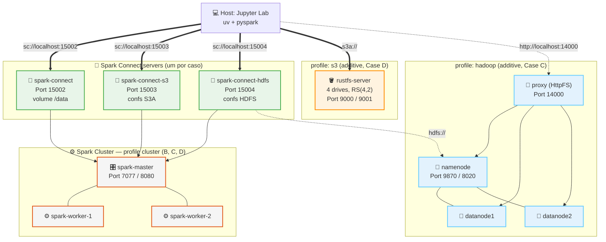

# ⚡ cdn-spark-lab: Apache Spark, Do Laptop ao Cluster

### **O Guia Prático de Processamento Distribuído de Dados**
Veja o *mesmo* pipeline Bronze→Silver→Gold rodar em 4 infraestruturas crescentes — processo local, cluster Spark Standalone, HDFS e armazenamento de objetos compatível com S3 — com o Spark como o motor constante. Tese central: **Spark não substitui armazenamento, ele substitui o MapReduce.**


---

## 🎯 O que é este repositório?

Um **laboratório prático** construído em torno de uma única pergunta: o que realmente muda quando você migra um job Spark do seu laptop para um cluster real? Em vez de 4 demonstrações desconectadas, este laboratório executa o **mesmo pipeline e a mesma agregação Gold** em 4 arquiteturas progressivamente mais realistas, para que as diferenças que você vê sejam reais, não acidentais.

- 📖 **8 módulos teóricos** — limites do MapReduce, RDDs/linhagem, DAG e avaliação lazy, DataFrames/Catalyst/Tungsten, internals do PySpark, caching/AQE, Spark+HDFS, Spark+Armazenamento de Objetos.
- 💻 **13 laboratórios interativos (00–11)** — começando com 4 labs PySpark com sabor de negócios (`local[*]`, sem Docker), depois labs Spark Connect, S3 e HDFS.
- 🏗️ **Um `docker-compose.yml`, três perfis** — `cluster` (Spark Standalone + Spark Connect na porta 15002), `s3` (RustFS + Spark Connect S3 na porta 15003), `hadoop` (HDFS + Spark Connect HDFS na porta 15004). Profiles `s3` e `hadoop` reutilizam o mesmo master/workers do `cluster`. Sem YARN.
- 🧬 **Dataset sintético de negócios, reproduzível** — `empresas`/`funcionarios`/`vendas`, Faker + NumPy, semente fixa, gerado sob demanda nas escalas `small` ou `large` — zero dependência de internet.
- 🏁 **Um benchmark de encerramento** — a mesma agregação Gold (vendas por setor/mês, broadcast join) medida nas arquiteturas lado a lado.

> **Público-alvo:** Engenheiros de dados, estudantes e qualquer um que já executou `pip install pyspark` e agora quer entender o que muda quando o Spark deixa de estar sozinho na máquina.

---

## 🧭 Os 4 Casos

| Caso | Conexão | Gerenciador de cluster | Armazenamento |
|---|---|---|---|
| **A — Local** | `local[*]` embutido | Nenhum (processo único) | Disco local |
| **B — Cluster** | `sc://localhost:15002` | Spark Standalone (Docker) | Volume Docker `/data` |
| **C — HDFS** | `sc://localhost:15004` | Spark Standalone (Docker) | HDFS `hdfs://namenode:8020` |
| **D — Object Storage** | `sc://localhost:15003` | Spark Standalone (Docker) | RustFS `s3a://` |

O cluster Spark (master + 2 workers) é o **mesmo** para B, C e D — o que muda é o Spark Connect server que você escolhe conectar. Cada um carrega confs diferentes (volume local / HDFS / S3A). O fluxo do cliente é sempre `make setup-env` → `make jupyter`.

```bash
make spark      # Caso B — Spark Connect na porta 15002 (volume /data)
make s3         # Caso D — Spark Connect S3 na porta 15003 (aditivo ao B)
make hadoop     # Caso C — Spark Connect HDFS na porta 15004 (aditivo ao B)
```

---

## ⚡ Início Rápido

```bash
# 1. Clone o repositório
git clone https://github.com/hiltonmbr/cdn-spark-lab.git
cd cdn-spark-lab

# 2. Gere o dataset sintético (Caso A usa `small` por padrão)
make setup-env
make generate-data SCALE=small

# 3. Inicie o Jupyter Lab e comece com o Lab 00
make jupyter
```

O Caso A (Labs 00–04) não precisa de nada além disso — sem Docker necessário. Casos posteriores ativam sua própria infraestrutura sob demanda:

```bash
make spark    # Caso B — Spark Standalone (master + 2 workers + Spark Connect na 15002)
make s3       # Caso D — adiciona RustFS + Spark Connect S3 (15003) ao cluster
make hadoop   # Caso C — adiciona HDFS + Spark Connect HDFS (15004) ao cluster
make full     # Tudo de uma vez: Spark + RustFS + HDFS
make down     # Para tudo
```

Execute `notebooks/00_setup_check.ipynb` primeiro para confirmar que Python, PySpark e Docker estão prontos antes de cada nível.

---

## ⚙️ Pré-requisitos

| Requisito | Detalhes |
|---|---|
| **Docker Engine** | Necessário para Casos B, C, D (Caso A roda sem Docker algum) |
| **Docker Compose** | Embutido no Docker Desktop |
| **uv** | Gerenciador de pacotes Python rápido ([Instalação](https://docs.astral.sh/uv/getting-started/installation/)) |
| **Make** | Usado em todos atalhos abaixo (opcional — veja o [Makefile](Makefile) para os comandos brutos) |
| **Recursos** | ~4 GB RAM para perfis `cluster`/`s3`; **8 GB recomendados** para o perfil `hadoop` (~7 serviços) |
| **Disco** | Alguns GB livres para a escala `large` do dataset e replicação HDFS |

```bash
docker version && docker compose version && uv --version
```

---

## 🗺️ Mapa de Aprendizado

### 📖 Teoria

| # | Módulo | Antecede |
|:---:|---|:---:|
| 1 | [Do MapReduce ao Spark](docs/01-do-mapreduce-ao-spark.md) | Nível A |
| 2 | [RDDs, Linhagem & Particionamento](docs/02-rdds-linhagem-particoes.md) | Nível A |
| 3 | [Transformações, Ações & o DAG](docs/03-transformacoes-acoes-dag.md) | Nível B |
| 4 | [DataFrames, Spark SQL, Catalyst & Tungsten](docs/04-dataframes-catalyst-tungsten.md) | Nível B |
| 5 | [PySpark na Prática](docs/05-pyspark-na-pratica.md) | Nível B |
| 6 | [Persistência & Otimização](docs/06-persistencia-e-otimizacao.md) | Nível B |
| 7 | [Spark + HDFS](docs/07-spark-e-hdfs.md) | Nível C |
| 8 | [Spark + Armazenamento de Objetos](docs/08-spark-e-armazenamento-objetos.md) | Nível D |

### 🧪 Laboratórios Práticos

| # | Nível | Notebook | Foco |
|:---:|:---:|---|---|
| 00 | — | [Setup Check](notebooks/00_setup_check.ipynb) | Valida Python, pyspark, Docker por nível |
| 01 | A · Local | [Primeiros Passos com PySpark](notebooks/01_primeiros_passos_pyspark.ipynb) | `select`, `filter`, `withColumn`, `show`/`collect`/`toPandas` |
| 02 | A · Local | [Agregações de Negócio](notebooks/02_agregacoes_de_negocio.ipynb) | `groupBy`/`agg`/`orderBy` |
| 03 | A · Local | [Joins: Vendas + Funcionários + Empresas](notebooks/03_joins_vendas_funcionarios_empresas.ipynb) | Ranking, receita por setor, joins encadeados |
| 04 | A · Local | [Por Trás dos Panos](notebooks/04_por_tras_dos_panos.ipynb) | Linhagem RDD, DAG, plano Catalyst, Spark SQL |
| 05 | B · Cluster | [Spark Connect](notebooks/05_spark_connect.ipynb) | Cluster Standalone, thin client, Spark UI |
| 06 | B · Cluster | [Shuffle, Broadcast Join](notebooks/06_shuffle_broadcast_join.ipynb) | Broadcast vs shuffle join |
| 07 | B · Cluster | [Cache & Storage Levels](notebooks/07_cache_storage_levels.ipynb) | persist/unpersist, AQE |
| 08 | B · Cluster | [Múltiplos Formatos](notebooks/08_multiplos_formatos_arquivo.ipynb) | CSV, JSON, Parquet, Bronze→Silver |
| 10 | D · S3 | [Spark + S3 (RustFS)](notebooks/10_spark_s3_datalake.ipynb) | Datalake em S3 object store, Spark Connect s3 |
| 11 | C · HDFS | [Spark + HDFS](notebooks/11_spark_hdfs_datalake.ipynb) | Datalake em HDFS via Spark Connect |
| 13 | Capstone | 🏁 Benchmark | Mesmo job Gold nas 4 arquiteturas |

---

## 🏗️ Estrutura do Projeto

```
cdn-spark-lab/
├── docs/                      # 8 módulos teóricos
├── notebooks/                 # 12 laboratórios (00-11)
├── scripts/
│   ├── lab_utils.py           # Fábrica de SparkSession + helpers bronze/silver/gold + benchmark
│   ├── generate_dataset.py    # Gerador de dataset sintético (Faker + NumPy, semente fixa)
│   └── start-hdfs.sh / init-datanode.sh  # Scripts de bootstrap HDFS
├── config/
│   └── hadoop/                # Config XML HDFS (profile "hadoop", renderizado a partir de .env)
├── tests/
│   └── test_lab_utils.py      # Testes unitários (sem Docker)
├── docker-compose.yml         # perfis: cluster, s3, hadoop
├── Makefile
├── pyproject.toml             # pyspark[connect], boto3, pandas, pyarrow, faker
└── data/ (git-ignored)        # bronze/silver/gold, gerado localmente
```

---

## 🏛️ Arquitetura do Lab



---

## 📝 Referência do Makefile

```bash
# ── Dataset ────────────────────────────────────────────────────────
make generate-data SCALE=small|large  # Gera empresas/funcionarios/vendas

# ── Infraestrutura ──────────────────────────────────────────────────
make spark           # Caso B — Spark Standalone + Spark Connect (porta 15002)
make s3              # Caso D — adiciona RustFS + Spark Connect S3 (15003)
make hadoop          # Caso C — adiciona HDFS + Spark Connect HDFS (15004)
make full            # Tudo: Spark + RustFS + HDFS
make down            # Para tudo
make clean           # Destrói containers, volumes E dados locais/HDFS
make clean-data      # Limpa apenas datasets gerados em data/ e temp/
make status          # Mostra containers em execução
make logs            # Exibe logs de todos os containers em execução
make shell-<name>    # Acessa o shell de qualquer container

# ── Ambiente Python ────────────────────────────────────────────────
make setup-env       # Cria .venv com uv, registra kernel Jupyter
make jupyter         # Inicia o Jupyter Lab (mesmo comando para todos os casos)

# ── Qualidade ───────────────────────────────────────────────────────
make strip           # Remove todas as saídas dos notebooks
make check           # Verifica se os notebooks estão sem saídas
make lint            # Executa ruff em scripts/ e notebooks/
make test            # Executa pytest + nbmake
```

---

## 🧪 Executando Testes

```bash
# Testes unitários (sem Docker)
uv run pytest tests/test_lab_utils.py -v

# Testes end-to-end completos nos notebooks (ative o perfil relevante primeiro)
make spark
make test
```

---

## 📄 Licença e Referências

Este projeto é disponibilizado sob a [Licença MIT](LICENSE).

> **Material educacional aberto.** Criado para as aulas práticas da disciplina **Data Science for Business** (UFPB). Desenvolvido por Hilton Martins.

### Referências

- [Documentação do Apache Spark](https://spark.apache.org/docs/latest/)
- [Visão Geral do Spark Connect](https://spark.apache.org/docs/latest/spark-connect-overview.html)
- [WebHDFS REST API](https://hadoop.apache.org/docs/stable/hadoop-project-dist/hadoop-hdfs/WebHDFS.html)
- [Módulo Hadoop-AWS (`s3a://`)](https://hadoop.apache.org/docs/stable/hadoop-aws/tools/hadoop-aws/index.html)
- [Documentação Oficial do RustFS](https://docs.rustfs.com)
